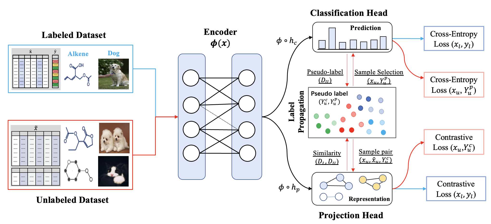

# DAST: Domain-Agnostic Self-Training for Semi-Supervised Learning
This is an  PyTorch implementation of DAST for images.




## Requirements

We recommend using `anaconda` or `miniconda` for python. Our code has been tested with `python=3.8` on linux.

```
pip install -r requirement.txt
```

Make sure the following requirements are met

* torch>=1.8.1
* torchvision>=0.9.1

- tensorboard
- numpy
- tqdm
- apex (optional)


## Training & Evaluation

In each of our experiments, we use a single Nvidia GeForce RTX 2080Ti GPU.

### Train

Train the model by 4000 labeled data of CIFAR-10& CIFAR-100 dataset:

```
python train.py --dataset cifar10 --num-labeled 4000 --arch wideresnet --batch-size 128 --lr 0.03 --expand-labels --seed 5 --out results/cifar10@4000.5
```

```
python train.py --dataset cifar100 --num-labeled 4000 --arch wideresnet --batch-size 64 --lr 0.03 --expand-labels --seed 5 --out results/cifar10@4000.5
```

### Arguments

* `--dataset` : Dataset from {cifar10,cifar100}
* `--num-labeled` : The number of labeled samples
* `--arch` : Model architectures, here we use the WRN.
* `--lr` : Learning rate

#### <span style="color:Tomato">Most of the hyperparameters are hardcoded in train.py file.</span>

### Evaluation

We choose the best model by evaluating the model on validation dataset. The accuracy of the best model on test datasets is printed after training is completed.


