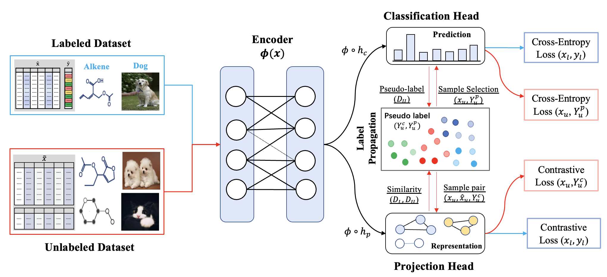

This repository is the  PyTorch implementation of DAST for tabular data.

# DAST: Domain-Agnostic Self-Training for Semi-Supervised Learning





## Requirements

We recommend using `anaconda` or `miniconda` for python. Our code has been tested with `python=3.8` on linux.

```
pip install -r requirement.txt
```

Make sure the following requirements are met

* torch>=1.8.1
* torchvision>=0.9.1


## Training & Evaluation

In each of our experiments, we use a single Nvidia GeForce RTX 2080Ti GPU.


To train the model(s) in the paper, run this command:

```
python train.py --dset_id <openml_dataset_id> --task <task_name> --attentiontype colrow --epochs 120 --lr 0.0001 --split 0.125
```

```
python train.py --dset_id 1590  --task multiclass  --attentiontype colrow  --epochs 120 --lr 0.0001 --split 0.0625 // Mfeat dataset

python train.py --dset_id 16  --task binary  --attentiontype colrow  --epochs 120 --lr 0.0001 --split 0.125 // 
```

### Arguments
* `--dset_id` : Dataset id from OpenML. Works with all the datasets mentioned in the paper. Works with all OpenML datasets.
* `--task` : The task we want to perform. Pick from 'multiclass', or 'binary'.
* `--epochs` : Training epochs.
* `--lr` : Learning rate
* `--split` : 0.0625 for 5% label ratio and 0.125 for 10% label ratio.

#### <span style="color:Tomato">Most of the hyperparameters are hardcoded in train.py file.</span>

### Evaluation

We choose the best model by evaluating the model on validation dataset. The AuROC(for binary classification datasets) and  Accuracy (for multiclass classification datasets) of the best model on test datasets is printed after training is completed.


